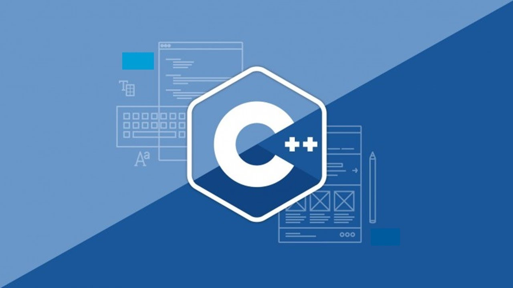

<h1 align = "center">Welcome to my repository.</h1>
<h2 align = "center">==== C++ ====</h2>

 

<h2>Here you will find the proyects about my carrer.</h2>

<h3>Samuel Salvador Soto Torres</h3>

**Carrer:** *Computer Systems Engineer*

**Group:** *ISC03B*

<h2 id="Table of contents">Table of contentes</h2>
<o>
<li><a href="https://github.com/UP210713/UP210713_CPP/tree/main/U1"> U1: Programing introduction </a></li>
<li><a href="https://github.com/UP210713/UP210713_CPP/tree/main/U2"> U2: Controle structures and cycles </a></li>
<li><a href="https://github.com/UP210713/UP210713_CPP/tree/main/U3"> U3: Functions </a></li>
<li><a href="https://github.com/UP210713/UP210713_CPP/tree/main/U4"> U4: Files and arrays </a></li>

*I like the programming and learn more about the programming* 

